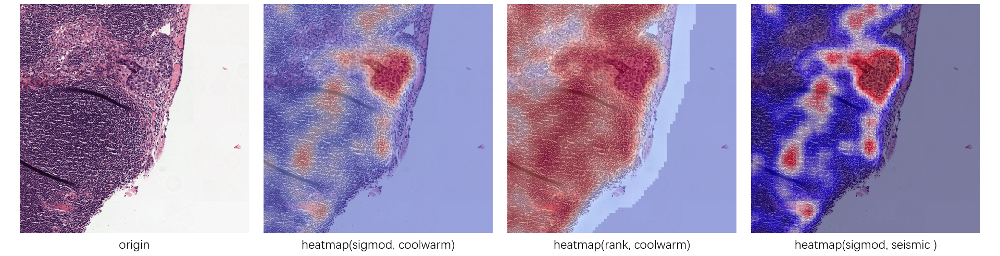

# WSI处理工具
## 目的

由于WSI图像尺寸一般都很大，无法使用普通的图像查看软件将其打开，也无法直接进行后续处理，因此实现了这一工具集合。

## 工具列表及其使用方法

- [基于Patch分类方法的组织病理WSI缩略热图生成器](./patch_based_heatmap_generator)；
- [WSI Patch提取器](./wsi_patch_generator/)；

## 效果

### 基于Patch分类方法的组织病理WSI缩略热图生成器

- 本工具生成的WSI缩略图热图如下图所示：
  
- 局部放大后的细节：
  
  

### WSI Patch提取器

- 提取WSI图像中的组织区域（绿色），组织区域中的孔洞（蓝色）以及肿瘤区域（红色）：

  

- 从组织区域中提取出的patch：

  