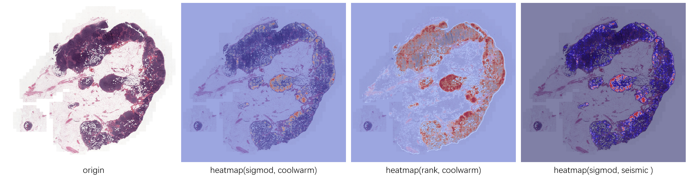
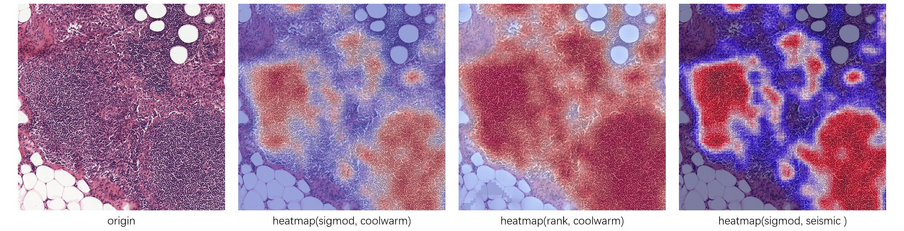

# 基于Patch分类方法的组织病理WSI缩略热图生成器
## 目的

由于WSI图像尺寸一般都很大，无法使用普通的图像查看软件将其打开，如果使用1:1的比例生成热图，首先，使用的内存空间会非常大，同时由于没有可用的WSI生成工具，生成的热图也无法保存成文件供用户查看。
因此，实现了这个热图缩略图生成小工具，用于将Patch的分类结果体现出来，直观看到方法效果。

## 效果

本工具生成的WSI缩略热图如下图所示：

将上图局部放大后的细节如下：



## 运行环境
- python==3.7
- numpy==1.18.1
- pillow==7.0.0
- opencv-python==4.1.1
- openslide-python==1.1.1 # 需要首先安装openslide的二进制包
- scipy==1.4.1
- matplotlib==3.1.1
- h5py==2.10.0
## 执行

```shell
python main.py --h5_dir ./patches/ --wsi_dir /repository01/houjianxin_build/clam/heatmap_test/wsi/ --thumbnail_dir ./thumbnails/ --heatmap_dir ./heatmaps/
```

其中：

- --h5_dir：保存patch坐标的h5文件的目录；
- --wsi_dir：保存WSI图像的目录；
- --thumbnail_dir：缩略图保存目录；
- --heatmap_dir：热图缩略图保存目录。

## 目录结构

```shell
├── core
│   └── PatchBasedHeatmapGenerator.py
├── main.py
├── patches
│   ├── test_010.h5
│   └── test_032.h5
└── README.md
```
其中：
- `core`下的`PatchBasedHeatmapGenerator.py`为关键代码；
- `patches`下的`test_010.h5`和`test_032.h5`为模型预测的结果，这里不提供模型，而是直接将结果写入到h5文件中，方便读者运行示例代码；
- `main.py`中包含使用`PatchBasedHeatmapGenerator.py`的示例代码。

## 其他说明

- 引用的WSI图像来源于[Camelyon16数据集中的test_010.tif和test_032.tif](https://camelyon17.grand-challenge.org/Data/)；

- main.py仅作为使用PatchBasedHeatmapGenerator的示例，PatchBasedHeatmapGenerator为核心代码；