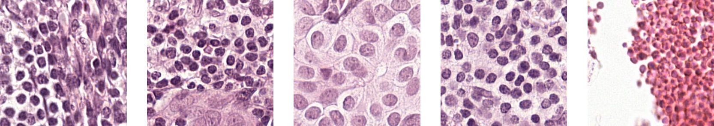

# WSI Patch提取器

## 目的

由于WSI图像太大，我需要将其输入到神经网络进行分类，整张图无法处理，因此我实现了这一切图工具。

## 效果

提取WSI图像中的组织区域（绿色），组织区域中的孔洞（蓝色）以及肿瘤区域（红色）：
从组织区域中提取出的patch：



## 运行环境

- python==3.7
- numpy==1.18.1
- pillow==7.0.0
- opencv-python==4.1.1
- openslide-python==1.1.1 # 需要首先安装openslide的二进制包
- scipy==1.4.1
- matplotlib==3.1.1
- h5py==2.10.0

## 执行

```shell
python main.py --save_dir ./patches/ --wsi_dir /repository02/houjianxin_build/dataset_code/CAMELYON16/testing/images --annotation_dir /repository02/houjianxin_build/dataset_code/CAMELYON16/testing/annotation
```

其中：

- --save_dir：保存patch坐标的h5文件及其分割结果的目录；
- --wsi_dir：保存WSI图像的目录；
- --annotation_dir：保存标注文件的目录。

## 目录结构

```shell
.
├── core
│   └── WSIPatchGenerator.py
├── main.py
└── utils
    └── tool.py
```

其中：

- `core`下的`WSIPatchGenerator`为关键代码；
- `utils`下的`tool.py`为其他代码可能用到的工具函数；
- `main.py`中包含使用`WSIPatchGenerator.py`的示例代码。

## 其他说明

- `main.py`仅作为使用`WSIPatchGenerator.py`的示例，`WSIPatchGenerator.py`为核心代码；
- `main.py`中的代码仅用于处理[Camelyon数据集](https://camelyon17.grand-challenge.org/)，但其实`WSIPatchGenerator.py`中包含的代码也可以用于处理其他任何组织病理WSI。

## 参考仓库

本工具的实现借鉴了以下仓库：

- [mahmoodlab/CLAM: Data-efficient and weakly supervised computational pathology on whole slide images - Nature Biomedical Engineering (github.com)](https://github.com/mahmoodlab/CLAM)。